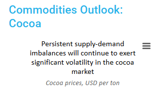

<link rel="stylesheet" href="doc/assets/style.css">

# Cocoa Data Unlocked

Explore historical price trends, inventory shifts, and futures market signals to understand where the cocoa market stands today.

## Prices

<iframe title="Price volatility has increased significantly since H2 2023" aria-label="Interactive line chart" id="datawrapper-chart-fzrby" src="https://datawrapper.dwcdn.net/fzrby/1/" scrolling="no" frameborder="0" style="width: 0; min-width: 100% !important; border: none;" height="438" data-external="1"></iframe>

## Inventory levels

<iframe title="Cocoa inventories are rebounding given tariff tensions" aria-label="Interactive line chart" id="datawrapper-chart-88Nf2" src="https://datawrapper.dwcdn.net/88Nf2/2/" scrolling="no" frameborder="0" style="width: 0; min-width: 100% !important; border: none;" height="424" data-external="1"></iframe>

## Cocoa futures quotes

<iframe title="Cocoa futures backwardation reflects supply challenges" aria-label="Column Chart" id="datawrapper-chart-nZXcD" src="https://datawrapper.dwcdn.net/nZXcD/1/" scrolling="no" frameborder="0" style="width: 0; min-width: 100% !important; border: none;" height="452" data-external="1"></iframe>

# Plan Ahead with Updated Forecasts

Access forward-looking price projections designed to support planning, budgeting, and risk management decisions.

<iframe title="FV cocoa price forecasts signals lower prices compared to 2024, but our risk outlook is tilted toward higher prices" aria-label="Table" id="datawrapper-chart-NNq1v" src="https://datawrapper.dwcdn.net/NNq1v/2/" scrolling="no" frameborder="0" style="width: 0; min-width: 100% !important; border: none;" height="489" data-external="1"></iframe>

# In-Depth Insights

Dive into expert analysis and strategic takeaways that translate data into action across sourcing, pricing, and operations.

<table>
  <tr>
    <td>
      
    </td>
    <td>
      
    </td>
  </tr>
</table>

# Ask Our Experts

Need deeper insights?
  

Our experts are here to help—just drop us a line!

